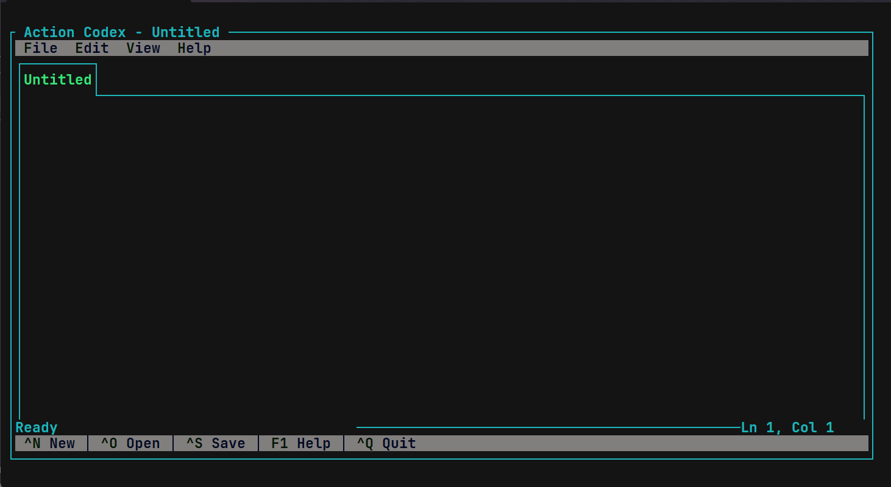

<div align="center">

# Action Codex
CLI Text Editor v1.0.1



</div>

## FEATURES
- Word Warp
- Dozen of Themes
- 4 Language Selection EN, ID, RU, DE

## BEFORE YOU USE THIS PLEASE READ THIS
This project is still in early development, so expect some bugs and missing features.
So if you want to contribute, please fork this repository and create a pull request.
Feel free to contribute to this project, whether it's fixing bugs, adding new features, or improving the documentation.

## HOW TO USE
### REQUIRED
- .NET 10.0 SDK or later
- A terminal that supports ANSI escape codes (e.g. Windows Terminal, PowerShell, Command Prompt, etc.)

### INSTALLATION
1. Clone this repository
	```bash
		git clone https://github.com/magercode/ActionCodex.git
	```
2. Now, navigate to the project directory 
	```bash
		cd ActionCodex
	```
3. Build the project
	```bash
		dotnet build
	```
	- or you can run it directly without building
	```bash
		dotnet run --project ActionCodex
	```

### SOCIAL
- [Telegram Group](https://t.me/xigmachat)
- [Telegram Channel](https://t.me/xigma98)